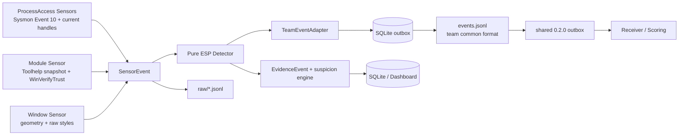

# Anti-ESP Evidence Monitor

Windows에서 게임 프로세스에 대한 외부 접근, 로드 모듈 변화, 외부 오버레이 정황을 실시간으로 수집해 **검토 우선순위용 의심도**를 계산하는 설치형 PoC다. 이 점수는 치트 사용 확률이나 유죄 판정이 아니며, 프로그램을 강제 종료하거나 사용자를 자동 차단하지 않는다.

기본 감시 대상은 `PenguinHotel-Win64-Shipping.exe`다. 설정 파일에서 실행 파일 이름을 바꿀 수 있다.

## 구조



센서는 관측 사실만 만든다. `score`, `suspicious`, 치트 확정 문구는 센서에 넣지 않는다. Detector는 `SensorEvent`만 받아 판정하므로 Sysmon, Win32, 파일 읽기 API에 직접 의존하지 않는다. 원시 이벤트와 판정 결과를 분리해 같은 로그를 ReplayAnalyzer에서 다시 재생할 수 있다.

두 값은 반드시 따로 해석한다.

- **의심도(Suspicion Score)**: 수집된 정황의 검토 우선순위다. 0~100의 규칙 기반 점수이며 확률이 아니다.
- **관측 신뢰도(Observation Confidence)**: 필요한 센서가 실제로 동작하고 있는 정도다. 게임이나 핵심 센서가 없으면 의심도가 있더라도 상태는 `INSUFFICIENT`가 된다.

## 현재 수집하는 근거

1. **프로세스 접근** — Sysmon Event ID 10에서 다른 프로세스가 게임을 열 때 요청한 권한을 확인하고, 별도 현재 핸들 센서가 시스템 핸들 스냅샷을 조회해 지금도 게임을 가리키는 외부 핸들을 확인한다. 현재 실행 중인 게임의 PID와 생성 시각까지 대조한다. `VM_READ`는 읽기 정황, `VM_WRITE`·`VM_OPERATION`·`CREATE_THREAD`는 변조 가능성이 더 큰 정황, `DUP_HANDLE`은 핸들 복제 정황으로 분류한다.
2. **외부 오버레이 창** — 게임 화면의 일정 비율 이상을 덮고, `layered`·`transparent`·`topmost` 중 두 가지 이상을 함께 가진 외부 창만 보조 정황으로 기록한다. 오버레이 하나만으로 높은 단계가 되지 않도록 점수 상한을 둔다.
3. **로드 모듈 변화** — Toolhelp 스냅샷으로 게임 프로세스의 모듈 경로·베이스 주소·이미지 크기를 비교한다. 첫 성공 스냅샷은 기준선으로 사용하고, 세션 텔레메트리가 켜져 있으면 각 항목을 `module_present` raw 이벤트로 남긴다. 기준선의 미서명·신뢰 거부 상태도 raw 사실로만 남기며, 정확한 알려진 악성 해시 일치가 아닌 한 점수화하지 않는다. 이후에는 추가·제거·메타데이터 변경도 기록한다. 새 DLL 자체는 인젝션 확정이 아니다.
4. **파일 신원·서명** — 기준선 및 새 모듈과 접근 주체 파일의 SHA-256을 캐시하고 `WinVerifyTrust` 결과를 `trusted / unsigned / rejected / error / unavailable` 사실 상태로 보존한다. `rejected`는 알려진 서명·정책 거부이고 `error`·`unavailable`은 판단 불가라서 점수화하지 않는다. 서명 결과 하나만으로 치트 판정을 내리지 않는다.

동일한 이벤트의 반복 가산을 막기 위해 중복 억제 시간, 범주별 최대 이벤트 수, 범주별 점수 상한, 유효 시간창을 적용한다. 센서 폭주가 발생해도 점수 계산용 메모리에는 범주별로 제한된 수의 강한 근거만 남긴다. 정상 프로그램은 실행 경로나 SHA-256으로 허용목록에 등록할 수 있다.

런처 통합 실행에서는 `client/Launcher/logs/anticheat_pids.json`의 PID와 프로세스
생성 시각이 현재 실행 인스턴스와 모두 일치하는 LocalGuard 프로세스를 접근 센서에서
제외한다. 숫자 PID만 같은 재사용 프로세스는 제외하지 않는다. Steam 예외도 이름이나
서명 하나만으로 허용하지 않는다. Windows 레지스트리에 기록된 Steam 설치 경로,
정상 Authenticode 신뢰, 실제 게임의 직계 부모 PID·부모 실행 경로·생성 시각, 게임 시작
직후의 전체 메모리 권한 조합이 모두 맞는 경우로 제한한다.

## 설치

요구 사항은 Windows 10/11, Python 3.11 이상, Microsoft Sysmon이다. Sysmon은 반드시 [Microsoft Sysinternals 공식 페이지](https://learn.microsoft.com/en-us/sysinternals/downloads/sysmon)에서 내려받는다.

PowerShell에서 프로젝트 폴더로 이동한 뒤 Python 의존성을 설치한다.

```powershell
cd C:\path\to\WHS4-GZZ\client\detectors\esp
py -3 -m pip install -r requirements.txt
Copy-Item .\config.example.json .\config.json
```

그 다음 **관리자 PowerShell**에서 Sysmon을 설치한다. 아래 경로는 실제로 압축을 푼 위치에 맞게 바꾼다.

```powershell
.\scripts\install_sysmon.ps1 -SysmonPath "C:\Tools\Sysmon64.exe"
```

이미 Sysmon이 설치된 PC에서는 스크립트가 기존 필터 설정을 임의로 덮어쓰지 않고 중단한다. 현재 설정을 검토하고 이 프로젝트의 `sysmon-config.xml`로 교체하려는 경우에만 명시적으로 실행한다.

```powershell
.\scripts\install_sysmon.ps1 -SysmonPath "C:\Tools\Sysmon64.exe" -UpdateExisting
```

환경 상태 확인:

```powershell
.\scripts\check_environment.ps1
```

Sysmon은 게임보다 먼저 설치·실행하는 것이 중요하다. 모니터는 첫 실행 때 현재 게임 PID와 게임 생성 시각 이후에 남은 기존 Event ID 10도 제한된 범위에서 읽지만, Sysmon 자체가 설치되기 전에 열린 핸들은 사후 복구할 수 없다.

## 실행

GUI 실행:

```powershell
python .\run.py
```

창이 뜨면 `시작`을 누른다. 게임이 실행되고 Sysmon 로그를 읽을 수 있어야 관측 신뢰도가 올라간다.

콘솔 실행:

```powershell
python .\run.py --headless
```

팀 테스트 세션과 플레이어를 지정해서 실행:

```powershell
py -3 .\run.py --headless --session-id normal_001 --player-id player_042 `
  --scenario normal --central-telemetry off
py -3 .\run.py --headless --session-id esp_001 --player-id player_042 `
  --scenario esp --cheat-on-ms 30000 --cheat-off-ms 70000 `
  --central-telemetry off
```

하나의 `session_id`는 한 번의 테스트에만 사용한다. 같은 이름의 세션
폴더가 이미 있으면 기존 로그에 이어 쓰지 않고 오류로 종료해 정상 구간과
ESP 구간이 섞이는 것을 막는다.

실행 시 출력되는 `team telemetry:` 경로 아래에 다음 구조가 생긴다.

```text
data/sessions/<session_id>/
├─ manifest.json
├─ events.jsonl
└─ raw/
   ├─ sysmon_process_access.jsonl
   ├─ current_process_handles.jsonl
   ├─ loaded_modules.jsonl
   └─ window_overlap.jsonl
```

`raw/`에는 센서별 원본 형식을 유지하고 `events.jsonl`에만 팀 공통 결과를 기록한다. 공통 결과의 `timestamp_ms`는 Unix 시간이 아니라 **세션 시작 후 경과시간**이다.

공통 이벤트는 SQLite outbox에 근거와 함께 먼저 커밋한 뒤 `events.jsonl`로 전달한다. 파일 기록이 실패하면 미전달 outbox가 남고, 같은 이벤트를 재전송해도 idempotency key로 JSONL 중복을 막는다. 수집 루프나 전면 실행에서 치명적 오류가 발생한 세션은 manifest를 `failed`로 닫아 정상 완료 로그와 구분한다.

`shared 0.2.0` 중앙 전송을 사용할 때는 저장소 루트의 공통 환경변수를 설정하고
`--central-telemetry managed`로 실행한다. 로컬 `events.jsonl` 기록이 끝난 뒤 같은
7필드 이벤트를 shared outbox에 큐잉한다. shared 큐잉이 실패하면 ESP 내부 outbox를
완료 처리하지 않아 다음 폴링에서 같은 content-derived UUID로 재시도한다.
`queued`는 로컬 shared outbox 저장 성공이며 receiver 수신 확인이 아니다. 서버 설정이
없으면 경고만 남기고 로컬 탐지는 계속한다.

Launcher는 `session_id`, `player_id`, 공통 `t0`, 중앙 전송 모드를 자동으로 넘긴다.
직접 실행하면서 공통 시간축을 맞추려면 `--t0 <세션 시작 Unix 초>`를 추가한다.
여러 detector를 동시에 실행할 때 shared outbox 경로는 Launcher가 모듈별로 분리한다.

```json
{
  "session_id": "esp_001",
  "player_id": "player_042",
  "module": "esp",
  "timestamp_ms": 7000,
  "evidence": {
    "source_pid": 4242,
    "target_pid": 777,
    "granted_access_hex": "0x00000010",
    "access_labels": ["VM_READ"]
  },
  "reasons": [
    "external process requested permission to read game memory"
  ],
  "raw_score": 2
}
```

ESP 모듈의 현재 원시 가중치는 `VM_WRITE/VM_OPERATION/CREATE_THREAD=3`, `VM_READ=2`, `DUP_HANDLE=1`, 오버레이 형태=1, 새 DLL·서명 이상 보조 신호=1이다. 이 값은 공통 서버의 최종 `risk_score`가 아니라 ReplayAnalyzer가 정상/ESP 로그를 비교해 보정할 입력이다.

30초만 실행하고 이번 세션의 근거를 JSONL로 내보내려면 다음처럼 실행한다.

```powershell
py -3 .\run.py --headless --duration 30 --central-telemetry off `
  --export-on-exit .\exports\evidence.jsonl
```

테스트 실행:

```powershell
py -3 -m unittest discover -s tests -v
```

## 허용목록

`config.json`의 `allowlist.paths`에는 실행 파일의 정확한 전체 경로를, `allowlist.sha256`에는 64자리 SHA-256을 넣는다. 이 목록은 Sysmon 프로세스 접근과 오버레이 창 정황 양쪽에 적용된다.

```json
{
  "allowlist": {
    "paths": [
      "C:\\Program Files\\Trusted Overlay\\overlay.exe"
    ],
    "sha256": [
      "0123456789abcdef0123456789abcdef0123456789abcdef0123456789abcdef"
    ]
  }
}
```

PowerShell에서 해시를 확인하는 방법:

```powershell
(Get-FileHash "C:\Program Files\Trusted Overlay\overlay.exe" -Algorithm SHA256).Hash.ToLower()
```

경로나 해시는 실제로 신뢰할 수 있는 파일인지 확인한 뒤 추가해야 한다. 경로만 허용하면 그 위치의 파일이 교체될 때도 신뢰하게 되므로 운영 환경에서는 해시 사용이 더 안전하다.

## 점수 해석

- `LOW`: 현재 유효한 근거가 없거나 약한 보조 정황만 있다.
- `REVIEW`: 사람이 원본 이벤트와 프로그램 경로를 확인할 가치가 있다.
- `HIGH`: 서로 보강하는 강한 정황 또는 반복 정황이 있다.
- `CRITICAL`: 점수가 90 이상인 높은 검토 우선순위다. 자동 제재 근거가 아니다.
- `INSUFFICIENT`: Sysmon, 게임 프로세스, 수집 루프 또는 센서 상태가 부족해 판정을 보류한다.

관리자 권한 또는 Sysmon 관측 채널이 없으면 다른 보조 센서가 켜져 있어도 `LOW`로
정상처럼 표시하지 않고 `INSUFFICIENT`로 유지한다. headless 수집 스레드가 예외로
종료되면 런처가 재시작·실패 처리를 할 수 있도록 프로세스도 0이 아닌 코드로 끝난다.

가중치는 `anti_esp/scoring.py`의 `DEFAULT_POLICIES`에 명시되어 있다. 현재 값은 PoC용 초기값이므로 실제 운영 전에는 정상 사용자 자료와 승인된 테스트 자료로 오탐률·미탐률을 측정해 보정해야 한다.

## 한계

- Sysmon Event ID 10은 한 프로세스가 다른 프로세스를 **연 시점과 요청 권한**을 보여 준다. 이후의 모든 `ReadProcessMemory` 호출을 하나씩 기록하지 않기 때문에 현재 핸들 센서를 함께 사용한다.
- 현재 핸들 센서는 64비트 Python을 요구하고 보호 프로세스나 `PROCESS_DUP_HANDLE` 접근이 거부된 소유자의 핸들은 확인하지 못할 수 있다. 시작 시 존재한 핸들은 첫 기준선에 넣는다. 새 핸들은 한 번만 보내고, 같은 핸들의 권한·소유 이미지가 실제로 바뀐 경우에만 `changed` 이벤트를 다시 만든다.
- 첫 모듈 스냅샷의 항목은 존재·파일 신원·서명 사실을 확인하지만, 존재 자체와 미서명·신뢰 거부 상태에는 점수를 주지 않는다. 정확한 알려진 악성 해시 일치만 예외다. 세션 텔레메트리가 비활성화되어 있으면 이 raw 이벤트는 디스크에 저장되지 않는다. LocalGuard보다 먼저 수동 매핑된 이미지, Toolhelp 목록에 등록되지 않은 이미지, 커널 드라이버 기반 접근은 모듈 변화 센서 하나로 찾을 수 없다.
- `WinVerifyTrust` 성공은 서명 체인이 Windows 정책상 수락됐다는 뜻이지 파일이 안전하다는 보장이 아니다. 반대로 사내·개인 빌드 DLL은 정상이어도 미서명일 수 있다.
- HWID 가명화는 기본 비활성화다. 켜더라도 원문 식별자를 저장하지 않고 HMAC 결과만 남기며, 서버 pepper가 없으면 재설치 후 값이 달라질 수 있는 설치 단위 가명이다.
- 현재 구현은 Sysmon 채널의 활성 상태를 확인하지만, 실행 중인 Sysmon 필터가 이 프로젝트 설정과 완전히 같은지는 런타임에 증명하지 않는다. 따라서 관측 신뢰도는 채널이 켜졌다는 이유만으로 100점이 되지 않는다.
- 첫 조회는 최대 512개의 최신 Event ID 10으로 제한한다. Sysmon에 다른 대상의 대량 로그가 이미 쌓인 환경에서는 더 오래된 접근이 조회 범위 밖일 수 있다.
- 정상 진단 도구, 보안 제품, 녹화·채팅·GPU 오버레이도 비슷한 정황을 만들 수 있다. 그래서 허용목록과 사람의 검토가 필요하다.
- 창 스타일 탐지는 보조 휴리스틱이다. 외부 창을 사용하지 않거나 스타일을 바꾼 구현은 놓칠 수 있다.
- 관리자·커널 권한 공격자, 드라이버 기반 접근, DMA, 센서 중지·변조까지 이 사용자 모드 PoC가 확실히 막지는 못한다.
- 이 도구는 탐지·기록용이지 예방용이 아니다. 서버 권위형 게임 로직, 클라이언트에 불필요한 적 위치를 보내지 않는 네트워크 설계, 코드 서명 및 별도 커널 보호는 게임 제작 단계에서 추가해야 한다.
- 개인 PC에 설치할 때는 수집 범위와 보관 정책을 사용자에게 알리고 동의를 받아야 한다. 기본 데이터는 `data/anti_esp.sqlite3`에 로컬 저장된다.
- 중앙 공통 이벤트는 event type별 허용 필드만 내보낸다. 컴퓨터 이름, Windows 사용자명, 창 제목, Sysmon 원본 data·call trace는 제외하고, 원본 sensor event ID는 해시한다. 실행 경로는 basename과 정규화된 경로의 SHA-256만 공유한다. 원시 로컬 센서 로그는 장애 분석 범위와 보관 정책에 따라 별도로 보호해야 한다.
- SQLite 기록은 자동 제재 자료가 아니며 현재 자동 삭제하지 않는다. 장기 운영에서는 보관 기간·최대 크기 정책을 별도로 정하고, 내보낸 뒤 데이터베이스를 순환해야 한다.
- 게임 프로세스는 기본적으로 실행 파일 이름으로 찾은 뒤 PID와 생성 시각을 확인한다. 운영 배포에서는 예상 설치 경로, 코드 서명 또는 게임 실행 파일 해시까지 추가 검증해야 한다.

Microsoft도 Sysmon 이벤트를 단독 경보가 아니라 조사에 쓰는 저수준 정황으로 설명하며, Event ID 10은 잡음이 많아 대상 필터링이 필요하다고 안내한다. 참고: [Sysmon 이벤트 설명](https://learn.microsoft.com/en-us/windows/security/operating-system-security/sysmon/sysmon-events), [Sysmon 공식 문서](https://learn.microsoft.com/en-us/sysinternals/downloads/sysmon), [Toolhelp 스냅샷](https://learn.microsoft.com/en-us/windows/win32/toolhelp/snapshots-of-the-system), [WinVerifyTrust](https://learn.microsoft.com/en-us/windows/win32/api/wintrust/nf-wintrust-winverifytrust).

## 주요 파일

- `run.py` — GUI/헤드리스 진입점
- `anti_esp/controller.py` — 센서, 저장소, 점수 엔진 통합
- `anti_esp/core/` — 센서 계약과 세션 출력
- `anti_esp/sensors/` — ProcessAccess, 모듈, 창, 서명, 가명 식별자 센서
- `anti_esp/detectors/esp_detector.py` — OS API가 없는 순수 ESP 판정기
- `anti_esp/pipeline.py` — Sensor → Detector → 저장 흐름
- `anti_esp/team_format.py` — 팀 공통 Event 변환
- `anti_esp/shared_transport.py` — shared 0.2.0 검증·idempotent 큐잉·종료 처리
- `anti_esp/sysmon.py` — Event ID 10 파싱과 폴링
- `anti_esp/overlay.py` — 창 겹침 및 스타일 휴리스틱
- `anti_esp/scoring.py` — 시간창, 중복 억제, 범주 상한과 상태 계산
- `anti_esp/store.py` — SQLite 보관과 JSONL 내보내기
- `anti_esp/dashboard.py` — 실시간 대시보드
- `sysmon-config.xml` — 게임 프로세스 대상 Event ID 10 필터
